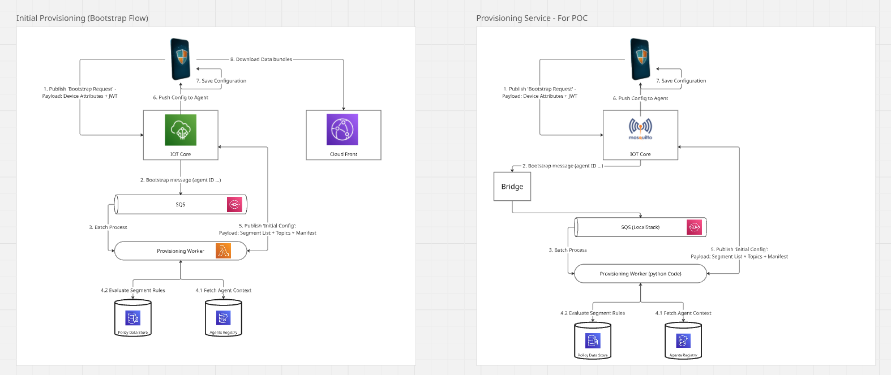
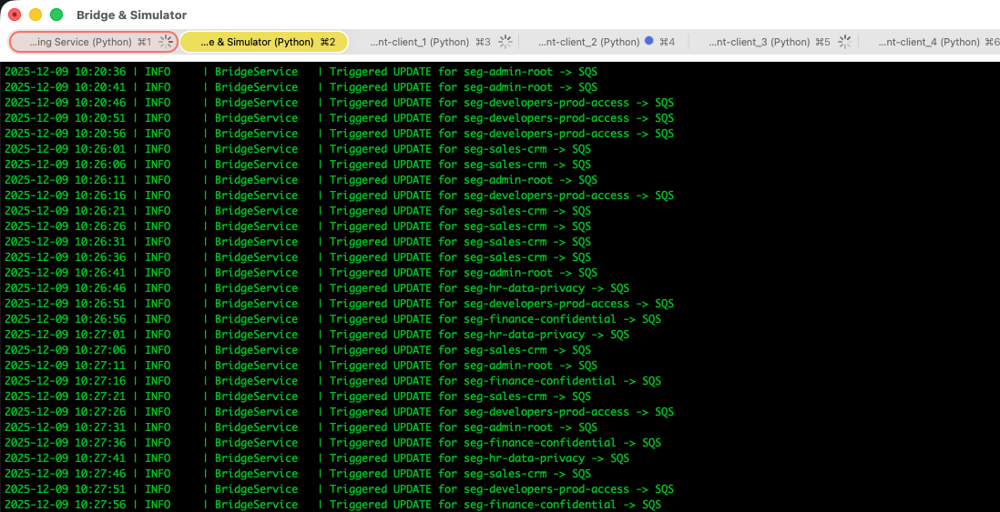
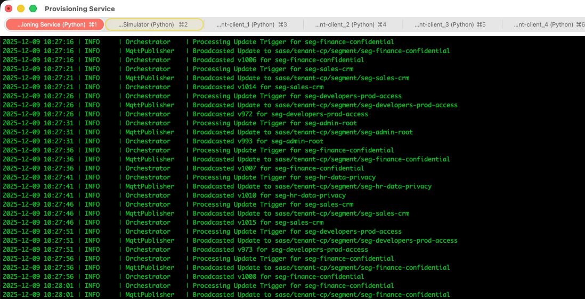
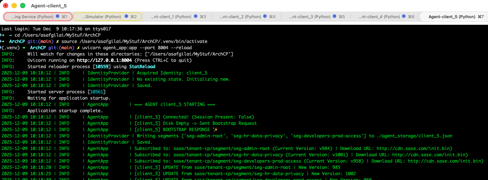
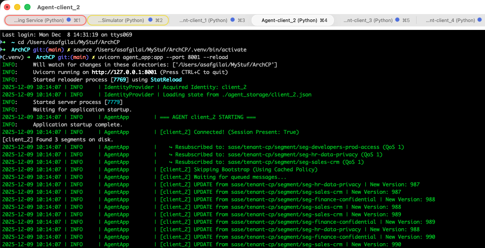

# User-Aware Policy Enforcement System (POC) Documentation

## 1. Executive Summary

This system demonstrates a **Cloud-Native, Event-Driven Policy Distribution Architecture** designed to distribute security policies to thousands of edge devices (Agents) in real-time. The architecture decouples the **Control Plane** (Management) from the **Data Plane** (Agents), ensuring high scalability, fault tolerance, and offline resilience.

---

## 2. System Architecture: POC vs. Production

The Proof of Concept (POC) is designed to mirror a production-grade AWS architecture using local, containerized equivalents. This ensures that the logic and event flows remain identical to the target cloud deployment.

*Figure 1: Comparison of the Target Cloud Architecture (Left) vs. the Local POC Architecture (Right).*

### Architecture Mapping

| Component | Target Cloud Architecture | POC Implementation | Role |
| :--- | :--- | :--- | :--- |
| **Connectivity** | **AWS IoT Core** | **Mosquitto** (Docker) | Manages persistent connections, MQTT topics, and device shadows. |
| **Queuing** | **AWS SQS** | **LocalStack SQS** (Docker) | Decouples the ingestion layer (Bridge) from the processing layer (Worker). |
| **Compute** | **AWS Lambda** | **Python Worker** | Processes logic, evaluates rules, and interacts with the database. |
| **Storage** | **DynamoDB / DocumentDB** | **MongoDB** (Docker) | Stores Agent Registries, Segmentation Rules, and Policy Versions. |
| **Bridge** | **IoT Rule Engine** | **Python Bridge** | Routes MQTT messages to SQS to ensure asynchronous processing. |

---

## 3. Infrastructure Components

The system runs on a fully containerized infrastructure managed via Docker Compose:

1.  **Mosquitto (MQTT Broker):**
    * Simulates the **AWS IoT Core** message broker.
    * Configured with **Persistence** enabled to store offline messages for disconnected agents (QoS 1).
    * Manages `client_id` sessions to ensure "Ghost Subscriptions" are maintained for resilience.

2.  **LocalStack (SQS Simulation):**
    * Simulates **AWS SQS**.
    * Provides a standard SQS endpoint (`http://localhost:4566`) for the Bridge to push messages and the Worker to pull them.
    * Enables the **CQRS pattern** (Command Query Responsibility Segregation) by buffering input spikes.

3.  **MongoDB (Database):**
    * Simulates the **Policy Data Store** and **Agent Registry**.
    * Persists segmentation rules (e.g., "HR Group -> HR Segment") and tracks the current version of every policy segment.

---

## 4. Operational Flows & Evidence

### A. The Simulator (The "Admin")
The **Bridge Service** acts as the source of all changes. It runs a background "Chaos Loop" that mimics an Administrator triggering policy updates for specific segments (e.g., updating the "Sales" or "Admin" segment).

**Behavior:**
* It generates an `UPDATE_TRIGGER` event based on live segments found in the DB.
* It pushes this event to **SQS**, decoupling the "Click" from the "Processing."

**Evidence:**
In the screenshot below, the Bridge/Simulator is actively triggering updates for segments like `seg-sales-crm`, `seg-admin-root`, and `seg-finance-confidential`.

*Figure 2: The Simulator triggering update events. Note the high frequency of updates simulating a busy admin environment.*

---

### B. The Provisioning Service (The "Brain")
The **Worker** is the core logic unit. It consumes the SQS queue and reacts to messages. It does not generate data; it processes commands from the Simulator or Agents.

**Behavior:**
1.  **Ingest:** Reads `UPDATE_TRIGGER` from SQS.
2.  **Logic:** Increments the version in MongoDB (e.g., `v1006` -> `v1007`).
3.  **Broadcast:** Publishes a notification to the specific MQTT topic `sase/tenant-cp/segment/{id}`.

**Evidence:**
The logs show precise correlation: "Processing Update Trigger" followed immediately by "Broadcasted v...".

*Figure 3: The Worker processing triggers, incrementing versions to v1000+, and broadcasting via MQTT.*

---

### C. Agent Behavior: Resilience & Real-Time Updates

The Agent simulates an end-user device. It manages its own local state on disk (`agent_storage/`) and enforces policies offline.

**Scenario 1: Ongoing Agent (Resilience)**
When an existing agent (`client_2`) restarts, it detects its local configuration file. It **skips the bootstrap request** and immediately re-subscribes to its assigned topics using the cached configuration.

**Evidence:**
* **Local State Detection:** `[client_2] Found 3 segments on disk.`
* **Optimization:** `[client_2] Skipping Bootstrap (Using Cached Policy)`
* **Offline Queue Processing:** `[client_2] Waiting for queued messages...` followed by a burst of updates.

Figure 4: Agent `client_5` performing initial onboarding. It detects no local state, requests its configuration, caches it to disk, and subscribes to its assigned policy topics.

*Figure 5: Agent `client_2` startup sequence showing local state loading, skipping bootstrap, and receiving real-time updates (versions reaching v990).*

**Scenario 2: Real-Time Enforcement**
Once connected, the agent receives a stream of updates pushed by the Provisioning Service. This demonstrates the system's ability to propagate changes instantly.

**Evidence:**
The logs show the agent receiving updates for `seg-finance-confidential`, `seg-sales-crm`, etc., with versions incrementing in real-time (e.g., `v988` -> `v989`).

---

## 5. Key Features Demonstrated

1.  **Offline Resilience:** The logs explicitly show `Session Present: True` and the agent waiting for queued messages. This proves the system delivers updates that occurred while the device was rebooting or in a tunnel.
2.  **Targeted Distribution:** `client_2` receives updates *only* for its assigned segments (Sales, HR, Finance). It does not receive irrelevant traffic, validating the segmentation logic.
3.  **Cloud-Native Decoupling:** The use of SQS buffers the Provisioning Service from the high-frequency inputs of the Bridge/Simulator, ensuring the backend is never overwhelmed.